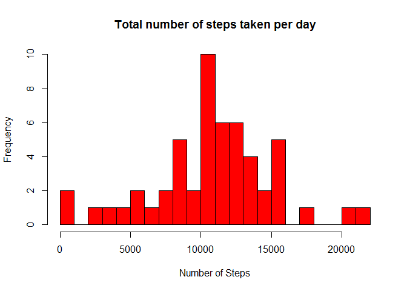
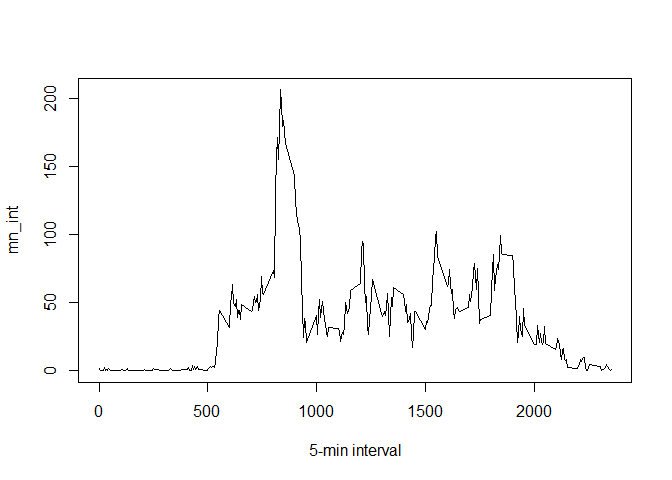
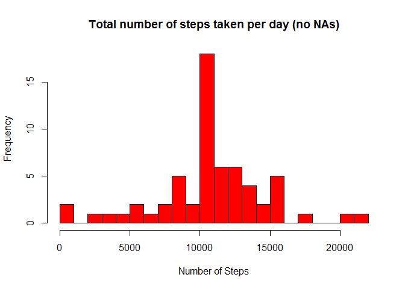
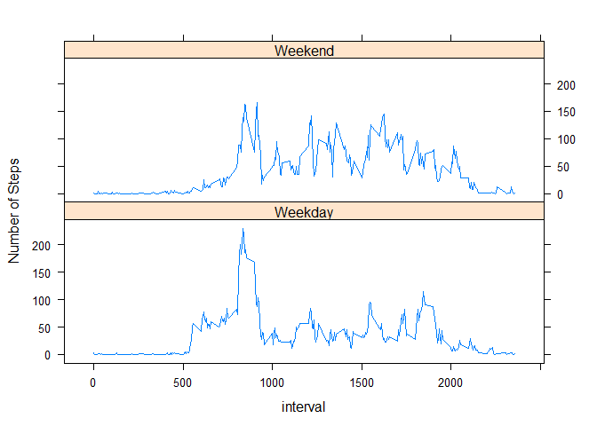

It is now possible to collect a large amount of data about personal movement using activity monitoring devices such as a Fitbit, Nike Fuelband, or Jawbone Up. These type of devices are part of the "quantified self" movement -- a group of enthusiasts who take measurements about themselves regularly to improve their health, to find patterns in their behavior, or because they are tech geeks. But these data remain under-utilized both because the raw data are hard to obtain and there is a lack of statistical methods and software for processing and interpreting the data.

This assignment makes use of data from a personal activity monitoring device. This device collects data at 5 minute intervals through out the day. The data consists of two months of data from an anonymous individual collected during the months of October and November, 2012 and include the number of steps taken in 5 minute intervals each day.

## Loading and preprocessing the data

Show any code that is needed to

1. Load the data (i.e. read.csv())
2. Process/transform the data (if necessary) into a format suitable for your analysis

Reading the data from "activity.csv", defining komma as separator, and NA strings:


```r
echo = TRUE
data <- read.csv("activity.csv", header = TRUE, sep = ",", na.strings = "NA")
```

Looking at the head of the dataset, to see whether the data was loaded correctly:


```r
echo = TRUE
head(data)
```

```
##   steps       date interval
## 1    NA 2012-10-01        0
## 2    NA 2012-10-01        5
## 3    NA 2012-10-01       10
## 4    NA 2012-10-01       15
## 5    NA 2012-10-01       20
## 6    NA 2012-10-01       25
```


## What is mean total number of steps taken per day?

For this part of the assignment, you can ignore the missing values in the dataset.

1. Make a histogram of the total number of steps taken each day
2. Calculate and report the mean and median total number of steps taken per day

Aggregating the number of steps taken each day and adding column names to the created data frame:


```r
echo = TRUE
steps_each_day <- aggregate(steps ~ date, data, sum)
colnames(steps_each_day) <- c("date", "steps")
```

Generating the histogram:


```r
echo = TRUE
hist(as.numeric(steps_each_day$steps), breaks = 20, col = "red", xlab = "Number of Steps", main= "Total number of steps taken per day")
```

<!-- -->

Calculating the mean value:


```r
echo = TRUE
mean(steps_each_day$steps)
```

```
## [1] 10766.19
```

Calculating the median value:


```r
echo = TRUE
median(steps_each_day$steps)
```

```
## [1] 10765
```


## What is the average daily activity pattern?

1. Make a time series plot (i.e. type = "l") of the 5-minute interval (x-axis) and the average number of steps taken, averaged across all days (y-axis)
2. Which 5-minute interval, on average across all the days in the dataset, contains the maximum number of steps?

Generating a time series plot of the 5-minute interval and the averaged number of steps taken:


```r
echo = TRUE
mn_int <- tapply(data$steps, data$interval, mean, na.rm=T)
plot(mn_int ~ unique(data$interval), type="l", xlab = "5-min interval")
```

<!-- -->

Showing th 5-minute interval that contains the maximum number of steps (line one) and its value (line two):


```r
echo = TRUE
mn_int[which.max(mn_int)]
```

```
##      835 
## 206.1698
```


## Imputing missing values

Note that there are a number of days/intervals where there are missing values (coded as NA). The presence of missing days may introduce bias into some calculations or summaries of the data.

1. Calculate and report the total number of missing values in the dataset (i.e. the total number of rows with NAs)


```r
echo = TRUE
sum(is.na(as.character(data$steps)))
```

```
## [1] 2304
```

```r
sum(is.na(as.character(data$date)))
```

```
## [1] 0
```

```r
sum(is.na(as.character(data$interval)))
```

```
## [1] 0
```

The total number of NAs is 2304, all of them in the "steps" variable.

2. Devise a strategy for filling in all of the missing values in the dataset. The strategy does not need to be sophisticated. For example, you could use the mean/median for that day, or the mean for that 5-minute interval, etc.
3. Create a new dataset that is equal to the original dataset but with the missing data filled in.

For any NA in the step variable, the mean (of steps) of the corresponding interval is taken as the replacing value. The "mn_int"" contains the mean for each single interval calculated over the 61 days. The right value coming from "mn_int"" is going to be used to replace the NA at the same interval.


```r
echo = TRUE
data2 <- data
for (i in 1:nrow(data)){
    if(is.na(data$steps[i])){
        data2$steps[i] <- mn_int[[as.character(data[i, "interval"])]]
    }
}
```

4. Make a histogram of the total number of steps taken each day and Calculate and report the mean and median total number of steps taken per day. Do these values differ from the estimates from the first part of the assignment? What is the impact of imputing missing data on the estimates of the total daily number of steps?

Creating a data frame with the steps taken for each day:


```r
echo = TRUE
steps_each_day_complete <- aggregate(steps ~ date, data = data2, sum)
```

Adding column names to the created data frame:


```r
echo = TRUE
colnames(steps_each_day_complete) <- c("date", "steps")
```

Generating the histogram:


```r
hist(as.numeric(steps_each_day_complete$steps), breaks = 20, col = "red", xlab = "Number of Steps", main= "Total number of steps taken per day (no NAs)")
```

<!-- -->

Calculating the mean value:


```r
echo = TRUE
mean(steps_each_day_complete$steps)
```

```
## [1] 10766.19
```

Calculating the median value:


```r
echo = TRUE
median(steps_each_day_complete$steps)
```

```
## [1] 10766.19
```

The mean of the complete dataset is equal to the mean of the dataset without missing values. The median shows a small difference, but is almost identical to the previous value.


## Are there differences in activity patterns between weekdays and weekends?

Creating a factor variable "day "to store the day of the week, a logical variable "is_weekday" (weekday=TRUE, weekend=FALSE), and the average number of steps for weekdays and weekends:


```r
echo = TRUE
data2$date <- as.Date(data2$date, format = "%Y-%m-%d")
data$interval <- factor(data$interval)
data2$day <- as.factor(weekdays(data2$date))

data2$is_weekday <- ifelse(!(data2$day %in% c("Samstag","Sonntag")), TRUE, FALSE) 

weekdays_data <- data2[data2$is_weekday,]
steps_per_interval_weekdays <- aggregate(weekdays_data$steps, by=list(interval=weekdays_data$interval), FUN=mean)

weekends_data <- data2[!data2$is_weekday,]
steps_per_interval_weekends <- aggregate(weekends_data$steps, by=list(interval=weekends_data$interval), FUN=mean)
```

Adding columns names, adding a column to indicate the day, merging the two together, and converting the day variabke to a factor:


```r
echo = TRUE
colnames(steps_per_interval_weekdays) <- c("interval", "average_steps")
colnames(steps_per_interval_weekends) <- c("interval", "average_steps")

steps_per_interval_weekdays$day <- "Weekday"
steps_per_interval_weekends$day <- "Weekend"

week_data <- rbind(steps_per_interval_weekends, steps_per_interval_weekdays)

week_data$day <- as.factor(week_data$day)
```

Generating the plot:


```r
library(lattice)
xyplot(average_steps ~  interval | day, data = week_data, layout = c(1,2), type ="l", ylab="Number of Steps")
```

<!-- -->

The results show that the activity starts earlier on weekdays, but the overall activity is higher on weekends.
